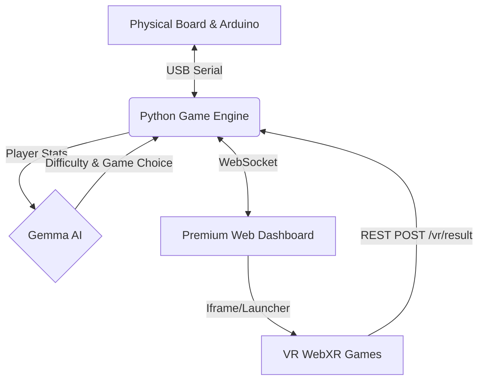

<div align="center">
  
  <h1>🌺 MAVELI.AI 🌺</h1>
  <p><strong>A Next-Gen Adaptive Physical-AI Onam VR Experience</strong></p>

  <p>
    <a href="#features">Features</a> •
    <a href="#architecture">Architecture</a> •
    <a href="#setup">Setup & Installation</a> •
    <a href="#gameplay-loop">Gameplay Loop</a>
  </p>

  <p>
    
    
    
    
    
  </p>
</div>

---

## 🌟 Overview

**MAVELI.AI** bridges the gap between traditional board games, immersive Virtual Reality (WebXR), and cutting-edge adaptive AI. Play a physically engineered Snake & Ladder board game where landing on specific zones dynamically drops you into an Onam-themed VR challenge on the Meta Quest 3! 

Powered by **Gemma** (via Ollama), the game continuously tracks player performance to adapt difficulty on the fly, creating a responsive physical-AI loop where virtual success directly controls physical servos and LEDs on the board.

---

## ✨ Features

- 🎮 **Physical-AI Integration:** Real-world button presses and hardware interact directly with VR environments and LLM decision-making.
- 🧠 **Adaptive Difficulty Engine:** Uses Google's Gemma to analyze player statistics (response times, success rates) and auto-tune the difficulty of VR challenges in real time.
- 🥽 **Immersive WebXR Games:** Play dynamic mini-games directly in the browser:
  - [Uri-Adi](https://uri-adi.vercel.app/)
  - [Vallamkali](https://vallamkali.vercel.app/)
  - [Sadya Memory](https://level-2-memory.vercel.app/)
  - [Chenda Master](https://chenda.vercel.app/)
- 🧩 **Trivia Engine:** Lands on a Trivia cell? The backend parses a rich markdown-based trivia pool and quizzes you on Onam facts!
- 🖥️ **Premium Dashboard:** A beautiful, responsive glassmorphism dashboard that acts as the referee screen and VR game launcher.
- 🤖 **Servo & LED Matrix Control:** Sends direct commands to an Arduino to move a Mahabali servo and highlight zones on an 18x20 LED board.

---

## 🏗️ Architecture



- **`game_engine.py`**: The referee. Manages state, RNG, positions, and triggers VR/Trivia challenges.
- **`gemma_adaptive.py`**: The brain. Evaluates player stats and instructs the engine on difficulty & game type.
- **`serial_handler.py`**: The bridge. Reads physical button presses and drives servos/LEDs.
- **`trivia_parser.py`**: The quizmaster. Parses `questions.md` dynamically into game challenges.
- **`main.py`**: The server. Serves static files, hosts the dashboard, and manages WebSocket connections.

---

## 🚀 Setup & Installation

### 1. Backend Setup
Ensure you have Python 3.10+ installed.

```bash
git clone https://github.com/amrutham-24/MAVELI.AI.git
cd MAVELI.AI

# Create virtual environment (optional but recommended)
python -m venv venv
source venv/bin/activate  # On Windows: venv\Scripts\activate

# Install dependencies
pip install -r requirements.txt
```

### 2. Configure Gemma (Adaptive AI)
Gemma runs locally via Ollama to ensure offline reliability and low latency.
```bash
ollama pull gemma3:4b
ollama serve
```
> [!TIP]
> If Ollama is unavailable, the system safely falls back to a built-in heuristic engine so your demo will never break!

### 3. Hardware Configuration (Optional)
If you are connecting the physical Arduino board, ensure `config.py` has the correct `SERIAL_PORT` and `SERIAL_BAUD`. 
If you are running a software-only demo, `main.py` defaults to `USE_MOCK_ESP32 = True`.

### 4. Run the Server
```bash
uvicorn main:app --host 0.0.0.0 --port 8000 --reload
```

### 5. Launch the Experience
1. Open a browser and navigate to **[http://localhost:8000/static/index.html](http://localhost:8000/static/index.html)**.
2. If using a Meta Quest 3, open the same URL (replace `localhost` with your laptop's local IP) in the Quest Browser.
3. Use the **Roll Dice** button on the dashboard (or press the physical button on the board) to play!

---

## 🔄 The Gameplay Loop

> Player rolls physically → Arduino reports the button press → Game Engine moves the piece and drives the wheel servo → If landed on a snake, ladder, or trivia zone, the engine asks **Gemma** to size the next VR challenge to that specific player's recent performance → The VR dashboard launches the mini-game → The VR result comes back → Game Engine updates the board *and* physically moves the Mahabali servo based on player success. 

<div align="center">
  <p><i>That last step — an AI decision changing a physical object in the real world — is the Physical-AI story.</i></p>
</div>

---

## 📸 Image Documentation

<div align="center">
  
  
  
  
</div>
